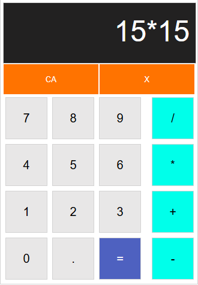
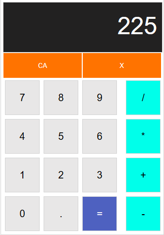

# 🧮 Hesap Makinesi Projesi

Bu proje, HTML, CSS ve JavaScript kullanılarak geliştirilmiş temel bir hesap makinesi uygulamasıdır. 
Kullanıcıların toplama, çıkarma, çarpma ve bölme işlemlerini basit bir arayüz üzerinden gerçekleştirmesini sağlar.

## 🚀 Özellikler

- Temel dört işlem ( + , − , × , ÷ )
- Duyarlı (responsive) tasarım
- Sade ve kullanıcı dostu arayüz
- Klavye desteği

## 🛠️ Kullanılan Teknolojiler

- HTML5  
- CSS3  
- JavaScript (Vanilla)

## 🖼️ Ekran Görüntüsü

